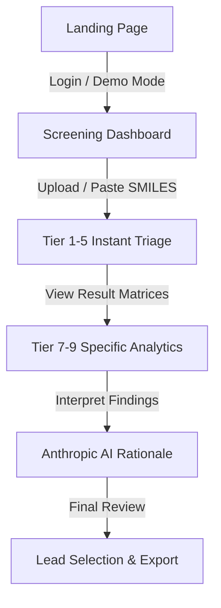

# ⬡ ChemoFilter: UX User Flow & Interaction Diagrams

**Designing the "Crystalline Obsidian" Experience**  
*Mapping the User Journey through 40+ Analytical Tabs*

---

## 1. Executive Overview

A complex scientific application requires a simple, intuitive user flow. **ChemoFilter** uses a linear progression from **Input** to **Lead Selection**. This document details the UX logic used in `app.py` to maintain a sub-second "Time-to-Lead" during the **VIT MDP 2026** presentation.

---

## 2. The Core 5-Stage User Flow (Mermaid)

---

## 3. Dealing with Complexity (The "Progressive Disclosure" Model)

ChemoFilter uses a **Progressive Disclosure** model for its 40+ tabs:

1.  **Stage 1: The Summary Card.** (Visible instantly). MW, LogP, TPSA.
2.  **Stage 2: The Detailed Table.** (One click away). hERG, PAINS, SA_Score.
3.  **Stage 3: The 3D conformer Explorer.** (Deep dive). Force-field coordinates.

---

## 4. UI/UX "Magic Moments" (For Demo Mode)

*   **Moment 1: The "Launch Animation".** Glassmorphism cards fading in. (UI WoW Factor).
*   **Moment 2: The "Cluster Auto-Sort".** Instant Tanimoto clustering. (Data WoW Factor).
*   **Moment 3: The "AI Reveal".** Anthropic Claude 3 writing its rationale live. (AI WoW Factor).

---

## 5. Accessibility: The "Scientific Color Palette"

Designing for a diverse user group:

| UI Accent | HSL/RGB | Requirement |
| :--- | :--- | :--- |
| **Neon Cyan** | HSL(182, 100%, 50%) | High contrast against Deep Obsidian. |
| **Toxic Orange** | HSL(16, 100%, 50%) | Universally recognized as a "Hazard" flag for PAINS. |
| **Ghost Slate** | HSL(192, 9%, 19%) | Low contrast for non-essential borders/dividers. |

---

## 6. Future: The "Chemo-Guided" UX (Phase 4)

Phase 4 Roadmap involves a **"Guided Discovery"** wizard, where the system asks: *"What is your target?"* (e.g. CNS vs. Cardiovascular), then automatically highlights the relevant ADMET metrics across all 40 tabs for that specific target class.
